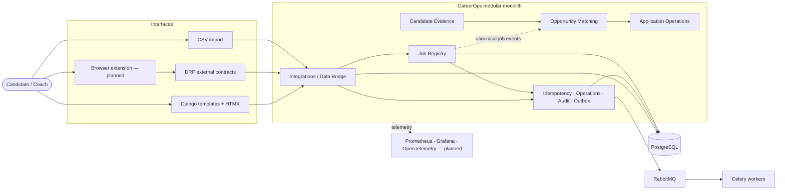

# CareerOps

CareerOps is a planned job intelligence and application operations platform for turning fragmented job-search information into structured, explainable, and actionable evidence.

The system is designed as a Django modular monolith. Its first implementation slice will capture job-source evidence, preserve it immutably, normalize it, resolve canonical job identity, and expose observable processing status. Candidate matching, application operations, and evidence-grounded generation follow only after those foundations are proven.

## Table of Contents

- [Overview](#overview)
- [Current Status](#current-status)
- [Product Scope](#product-scope)
- [Architecture](#architecture)
- [Technology Strategy](#technology-strategy)
- [Documentation](#documentation)
- [Roadmap](#roadmap)
- [Quality and Security](#quality-and-security)
- [Repository Structure](#repository-structure)
- [Local Development](#local-development)
- [License](#license)

## Overview

Job searches are typically spread across job boards, company career pages, recruiter messages, CV versions, interview notes, spreadsheets, and reminders. This fragmentation makes it difficult to answer basic questions reliably:

- Has this opportunity already been captured?
- Which evidence supports each requirement?
- Which CV version was used?
- When should the candidate follow up?
- Which sources and application strategies produce interviews?

CareerOps is intended to provide one controlled system for job capture, canonical identity, candidate evidence, opportunity assessment, application tracking, and outcome analysis.

It is not a generic job board, a basic CRUD tracker, an AI wrapper, or a React SPA with Django reduced to a JSON backend.

[Back to top](#careerops)

## Current Status

The project has entered the repository-engineering phase. The Django foundation exists; CareerOps domain features have not started.

| Area | Status |
| --- | --- |
| Product vision | Documented |
| Domain language | Documented |
| Bounded contexts | Documented |
| Integrations boundary | Documented for the first capture slice |
| Architecture diagrams | Drafted; final GitHub rendering pending |
| Conceptual ERD | v1 drafted and parser-validated; Data Bridge persistence reserved for v2 |
| Django scaffold | Implemented as the initial engineering foundation |
| Custom user model | Implemented before domain migrations |
| Health endpoints | Implemented |
| Python quality workflows | Added; activation requires the committed `uv.lock` |
| Product features | Not started |

The documentation distinguishes accepted design, planned implementation, and verified implementation. Nothing is described as running until it exists and has been tested.

[Back to top](#careerops)

## Product Scope

CareerOps is organized around five connected journeys:

1. **Capture and canonicalize a job** — accept evidence from approved channels, distinguish retries from source revisions, normalize the content, and resolve canonical identity without destroying source history.
2. **Evaluate an opportunity** — compare structured job requirements with candidate evidence through deterministic scoring and traceable explanations.
3. **Prepare an application** — select an appropriate CV version, supporting evidence, notes, contacts, salary expectations, and follow-up dates.
4. **Track an application** — move through controlled states while preserving an append-only transition history.
5. **Learn from outcomes** — analyse conversion, source performance, response time, evidence gaps, and application strategy.

The first implementation slice supports HTMX capture, browser-extension capture, and CSV import, and ends at canonicalization. Candidate evidence, opportunity matching, retrieval, generation, application operations, and analytics follow in later milestones.

See [Product Vision](docs/product/PRODUCT_VISION.md).

[Back to top](#careerops)

## Architecture

CareerOps is planned as one Django project, one PostgreSQL system of record, and one deployable modular monolith. Bounded contexts define vocabulary, ownership, and dependency direction; they are not microservices.



Integrations first preserves an immutable inbound envelope and translates it into a versioned CareerOps contract. The Job Registry then owns four separate lifecycle aggregates:

- `JobObservation` — immutable source evidence
- `JobNormalization` — versioned interpretation
- `JobResolution` — append-only identity decision
- `CanonicalJob` — controlled current understanding

Identity resolution is the one workflow permitted to coordinate those aggregates in a short atomic transaction. Requirement extraction, opportunity matching, notifications, projections, retrieval indexing, and external side effects occur only after commit.

See [Architecture](docs/architecture/ARCHITECTURE.md), [Diagrams](docs/architecture/DIAGRAMS.md), and the [Conceptual ERD](docs/architecture/erd/careerops.dbml).

[Back to top](#careerops)

## Technology Strategy

Technologies are grouped by responsibility rather than presented as a checklist.

| Responsibility | Planned technology | Purpose |
| --- | --- | --- |
| Application | Python 3.14, Django 6 | Domain framework, ORM, templates, and security primitives |
| Primary browser interaction | Django template partials, HTMX | Server-driven interaction without duplicated frontend business logic |
| Browser-specific behaviour | TypeScript | Typed behaviour for the extension and genuinely complex UI components |
| External contracts | Django REST Framework | Versioned APIs for real external clients |
| Persistence | PostgreSQL | System of record, constraints, search, locking, and transactional outbox |
| Asynchronous processing | Celery, RabbitMQ | Durable normalization, identity resolution, exports, and delivery workflows |
| Ephemeral coordination | Redis | Caching, rate limits, and short-lived coordination |
| Observability | Prometheus, Grafana, OpenTelemetry | Metrics, tracing, and production diagnosis |
| Engineering quality | uv, Ruff, mypy, django-stubs, pytest | Reproducible environments and enforced correctness |
| Delivery | Docker, GitHub Actions | Reproducible runtime and an enforced merge process |

pgvector, evidence-grounded generation, PostHog, Terraform, and Kubernetes remain deferred until a real consumer or operational constraint exists.

See [Technology Decisions](docs/planning/TECHNOLOGY_DECISIONS.md).

[Back to top](#careerops)

## Documentation

| Document | Purpose |
| --- | --- |
| [Product Vision](docs/product/PRODUCT_VISION.md) | Product boundary, users, journeys, and non-goals |
| [Domain Glossary](docs/domain/DOMAIN_GLOSSARY.md) | Authoritative domain terminology |
| [Bounded Contexts](docs/domain/BOUNDED_CONTEXTS.md) | Context ownership, dependency direction, and rejected alternatives |
| [Integrations](docs/domain/INTEGRATIONS.md) | Data Bridge contracts, provenance, replay layers, and channel scope |
| [Architecture](docs/architecture/ARCHITECTURE.md) | System structure and critical consistency boundaries |
| [Diagrams](docs/architecture/DIAGRAMS.md) | Diagram index and interpretation guide |
| [Conceptual ERD](docs/architecture/erd/careerops.dbml) | Conceptual entities and relationships |
| [Engineering Standards](docs/engineering/ENGINEERING_STANDARDS.md) | Code boundaries, quality gates, and completion criteria |
| [Security Model](docs/security/SECURITY_MODEL.md) | Security boundaries and planned controls |
| [Roadmap](docs/planning/ROADMAP.md) | Delivery sequence and open decisions |
| [Technology Decisions](docs/planning/TECHNOLOGY_DECISIONS.md) | Accepted, deferred, and rejected technologies |

The [Documentation Index](docs/README.md) provides the complete map.

[Back to top](#careerops)

## Roadmap

| Milestone | Outcome |
| --- | --- |
| Documentation baseline | Freeze vocabulary, boundaries, diagrams, and conceptual data ownership |
| Repository engineering foundation | Establish Django scaffold, strict tooling, containers, and CI/CD |
| Capture and canonicalize | Deliver the first vertical slice through idempotency, outbox, normalization, and identity resolution |
| Candidate evidence | Model attributable candidate experience and retrievable evidence |
| Deterministic matching | Produce inspectable requirement coverage and scoring |
| Retrieval and generation | Add semantic retrieval and evidence-grounded explanations after an evaluation set exists |
| Application operations | Implement controlled transitions, interviews, contacts, and follow-ups |
| Observability and analytics | Add operational objectives and outcome analysis against real workflows |

See [Roadmap](docs/planning/ROADMAP.md).

[Back to top](#careerops)

## Quality and Security

The planned engineering model is strict but deliberately practical:

- Ruff owns formatting, linting, common Python defects, and Django-specific checks.
- mypy with `django-stubs` owns type completeness.
- PostgreSQL tests own constraints and concurrency-sensitive invariants.
- Query budgets turn N+1 prevention into a regression test.
- API schema checks activate with the first DRF endpoint.
- Browser, accessibility, and runtime CSP checks activate with the first real HTMX journey.
- Celery reliability checks activate with the first durable workflow.
- Suppressions are explicit, justified, and tracked.

The security model includes workspace isolation, separate authentication boundaries for the first-party UI and external clients, strict browser security direction, bounded untrusted input, and a rule that advisory systems cannot directly write domain state.

No control is described as active until it has been implemented and verified.

See [Engineering Standards](docs/engineering/ENGINEERING_STANDARDS.md) and [Security Model](docs/security/SECURITY_MODEL.md).

[Back to top](#careerops)

## Repository Structure

Current repository foundation:

```text
careerops-platform/
├── README.md
├── pyproject.toml
├── manage.py
├── compose.yaml
├── config/
│   └── settings/
├── apps/
│   ├── accounts/
│   └── platform/
├── tests/
├── .github/
│   └── workflows/
└── docs/
    ├── README.md
    ├── product/
    ├── domain/
    ├── architecture/
    │   ├── adr/
    │   ├── diagrams/
    │   └── erd/
    ├── engineering/
    ├── security/
    └── planning/
```

The initial Django project, account boundary, health endpoints, architecture tests, and Python quality workflows are present. Product-domain applications and asynchronous infrastructure remain intentionally absent until their roadmap milestones.

[Back to top](#careerops)

## Local Development

CareerOps uses Python 3.14 and `uv`. Python dependencies and tool configuration live in `pyproject.toml`; no `requirements.txt`, `pytest.ini`, `mypy.ini`, or standalone Ruff configuration is supported.

On Windows, start Docker Desktop and wait for the Linux engine to report that it is running. Then initialise the environment from PowerShell:

```powershell
uv self update
uv --version
uv python install 3.14
uv python pin 3.14

Copy-Item .env.example .env -ErrorAction SilentlyContinue
docker context use desktop-linux
docker compose up -d postgres

uv lock
uv sync --locked --all-groups
uv run python manage.py migrate --settings=config.settings.local
uv run python manage.py runserver --settings=config.settings.local
```

The committed VS Code workspace settings use `.venv\Scripts\python.exe`, load `.env`, run pytest discovery from `apps/` and `tests/`, use Ruff as the Python formatter, and leave type-checking ownership to mypy.

Quality checks:

```bash
uv run ruff format --check .
uv run ruff check .
uv run mypy
uv run pytest
uv run python manage.py check --deploy --settings=config.settings.production
```

The provided Compose service exposes PostgreSQL on `127.0.0.1:55432`. Copy `.env.example` to `.env` before local execution. The initial `uv.lock` must be generated with uv 0.11.28 or later in a Python 3.14 environment before the locked CI workflows can pass.

[Back to top](#careerops)

## License

Licence selection remains open. No licence should be inferred until a licence file is committed.

[Back to top](#careerops)
