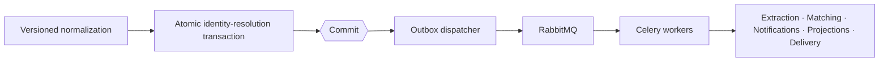

# Architecture

## Table of Contents

- [Goals](#goals)
- [System Shape](#system-shape)
- [Interface Boundaries](#interface-boundaries)
- [Integration Boundary](#integration-boundary)
- [Job Registry](#job-registry)
- [Identity Resolution Transaction](#identity-resolution-transaction)
- [Synchronous and Asynchronous Work](#synchronous-and-asynchronous-work)
- [Data Ownership](#data-ownership)
- [External Clients](#external-clients)
- [Security Boundary](#security-boundary)
- [Observability](#observability)
- [Architecture Status](#architecture-status)

## Goals

The architecture is intended to provide:

- Clear domain ownership without premature service decomposition
- Traceable source evidence and derived decisions
- Strong workspace isolation
- Short, explicit transaction boundaries
- Durable asynchronous processing after commit
- External API contracts without forcing the first-party UI through JSON
- Testable performance, security, and reliability properties
- A path from a single deployable system to later separation only where operational evidence justifies it

## System Shape

CareerOps is a Django modular monolith:

- One codebase
- One primary PostgreSQL database
- One deployable web application
- Separate background worker processes
- Internal bounded contexts enforced through module boundaries and application services
- Versioned events for asynchronous context integration

This structure keeps transactions and local development straightforward while preserving clear ownership. Bounded contexts are design boundaries, not deployment units.

See the [system-context diagram](diagrams/system-context.mmd) and [bounded-context map](diagrams/bounded-context-map.mmd).

## Interface Boundaries

| Interface | Responsibility | Authentication direction |
| --- | --- | --- |
| Django templates and HTMX | Primary first-party product interface | Django session and CSRF protection |
| TypeScript components | Browser-specific interaction that cannot be expressed cleanly through HTML exchange alone | Inherits the first-party browser session |
| Browser extension | Cross-origin job capture and status retrieval | OAuth or another installed-client flow |
| CSV import | Bounded batch capture with item-level provenance and failure reporting | Authenticated first-party session |
| DRF API | Stable contract for real external clients | Client-appropriate token or OAuth authentication |
| Inbound webhooks | Provider-defined payloads and signatures | Provider-specific signature verification |

HTMX returns server-rendered HTML. It does not call the DRF API merely to justify an API layer.

TypeScript is used where meaningful behaviour occurs in the browser before, during, or independently of a server request. Domain validation and authorization remain on the server.

## Integration Boundary

Integrations is the anti-corruption layer between external systems and CareerOps domain contexts. The informal term **Data Bridge** describes this responsibility.

The boundary follows this sequence:

```text
Provider payload or explicit user capture
        │
        ▼
InboundEnvelope
        │
        ▼
Versioned CareerOps contract
        │
        ▼
Owning domain service
```

The envelope proves safe receipt and provenance. The receiving domain decides meaning and state.

Provider schemas, credentials, cursors, delivery identifiers, and rate-limit behaviour stop at the adapter boundary. The Job Registry receives a provider-neutral capture contract rather than provider data.

The first capture slice supports HTMX capture, browser-extension capture, and CSV import. Native mobile, connected accounts, feeds, email, calendars, contacts, ATS integrations, and partner webhooks remain deferred.

For pull-based synchronization, committed envelope persistence is the durability point. A provider cursor may advance after those envelopes are committed; domain validation and processing continue asynchronously from the preserved payloads.

See the [Integrations specification](../domain/INTEGRATIONS.md).

## Job Registry

The Job Registry turns source evidence into canonical job opportunities.

```text
JobObservation
      │
      ▼
JobNormalization
      │
      ▼
JobResolution ─────────▶ CanonicalJob
```

The separation is intentional:

- An observation exists before canonical identity is known.
- A normalization is one versioned interpretation of that observation.
- A resolution records a decision without rewriting history.
- A canonical job is mutable current state assembled from traceable evidence.

This model supports invalid observations, ambiguous identity, source revisions, repeated observations from different providers, and later algorithm improvements.

See the [capture sequence](diagrams/capture-sequence.mmd), [observation lifecycle](diagrams/observation-state.mmd), and [resolution lifecycle](diagrams/resolution-state.mmd).

## Identity Resolution Transaction

Identity resolution is the one workflow that deliberately coordinates several Job Registry aggregates atomically.

The aggregates retain independent lifecycles, but three facts must never contradict one another:

- The observation's terminal resolution state
- The append-only resolution decision
- The canonical identity created or selected

### Inside the transaction

1. Acquire a transaction-scoped resolution lock for the workspace and identity bucket.
2. Recheck canonical candidates inside the protected section.
3. Append the `JobResolution`.
4. Create or enrich the `CanonicalJob` where applicable.
5. Advance the `JobObservation` to `resolved` or `ambiguous`.
6. Append audit records.
7. Append versioned outbox events.
8. Commit.

Canonical enrichment records the changed fields, previous and new values, update reason, canonical version, and originating resolution.

### After commit

The outbox dispatcher publishes committed work for:

- Requirement extraction
- Opportunity matching
- Notifications
- Search and analytics projections
- Retrieval indexing
- Signed webhook delivery
- Other external calls

An `on_commit` notification may reduce latency by waking the dispatcher. Durable polling remains the correctness mechanism.



See the detailed [resolution transaction diagram](diagrams/resolution-transaction.mmd).

### Concurrency

Two workers may process observations for the same real opportunity at the same time. Exact-source uniqueness does not prevent cross-source canonical duplication.

The planned resolution process uses a transaction-scoped PostgreSQL advisory lock derived from the workspace and a coarse identity bucket. Candidate lookup is repeated after the lock is acquired. The bucket serializes likely collisions without asserting that title, company, and location are globally unique.

A canonical merge workflow remains necessary for false negatives that cannot be prevented safely through automatic resolution.

## Synchronous and Asynchronous Work

| Work | Execution model | Reason |
| --- | --- | --- |
| Request parsing and authorization | Synchronous | Required before accepting work |
| Idempotency check | Synchronous transaction | Prevent duplicate accepted operations |
| Envelope persistence | Synchronous transaction | Preserve transport evidence before acknowledging receipt |
| Contract translation and observation acceptance | Asynchronous or bounded synchronous processing | Keep provider transport separate from domain evidence |
| Audit and outbox append | Same transaction | Keep state and event publication intent atomic |
| Normalization | Asynchronous | Potentially expensive and retryable |
| Identity resolution | Asynchronous, short database transaction | Requires controlled concurrency and durable retry |
| Requirement extraction | Post-commit asynchronous | Downstream interpretation |
| Opportunity matching | Post-commit asynchronous | Must not block registry correctness |
| Notifications and webhooks | Post-commit asynchronous | External side effects |
| Analytics and search projections | Post-commit asynchronous | Eventually consistent derived views |

## Data Ownership

The [conceptual ERD](erd/careerops.dbml) defines the current data model. The main ownership rules are:

- Workspace scope is explicit on tenant-sensitive records.
- Inbound envelopes preserve immutable transport evidence before domain acceptance.
- Source observations are immutable.
- Normalizations and resolutions are versioned.
- Canonical jobs retain traceable update history through events and versions.
- Application transition history is append-only; current state is a read optimization updated in the same transaction.
- Evidence matching cites chunks; the parent document remains derivable.
- Outbox, audit, operation, and idempotency records are shared mechanisms with domain references.
- Companies are workspace-scoped in the initial model. Cross-workspace company identity is deferred.

The ERD is conceptual. It is the v1 model for the Job Registry and downstream product domains. Data Bridge persistence is a separate v2 modelling scope and will not be silently added without a reviewed ERD revision. Django model details, indexes, and migrations will be finalized alongside implementation and PostgreSQL query plans.

## External Clients

Django REST Framework is justified by external consumers, not by the first-party HTMX interface.

The browser extension is the first planned client. Its requirements include:

- Cross-origin authentication
- API versioning
- Idempotent capture
- Structured error responses
- Operation status
- OpenAPI-generated TypeScript types

The native mobile application is the preferred future second client, but it remains deferred until the extension has proven the capture and operation-status contracts. Its first distinctive capability will be share-sheet capture rather than a duplicate web experience.

Inbound provider webhooks are handled through focused Django endpoints because their payloads and signature rules are defined by the sender rather than by CareerOps's public API contract.

## Security Boundary

The architecture assumes:

- Workspace scope is established before domain reads or writes.
- Reusable QuerySet vocabulary does not perform authorization.
- Session authentication and CSRF protection serve the first-party interface.
- External clients use separate credentials and scopes.
- Untrusted source content is treated as data.
- Generated output cannot authorize access, resolve identity, transition applications, or write domain state directly.
- Source payloads, uploads, and URLs have explicit size and type limits.
- Browser assets are self-hosted by default and compatible with a strict Content Security Policy.

See [Security Model](../security/SECURITY_MODEL.md).

## Observability

Observability follows complete workflows rather than isolated endpoints.

A capture trace should connect:

```text
Client request
→ observation transaction
→ outbox publication
→ normalization task
→ identity-resolution transaction
→ operation completion
```

Planned signals include:

- Request and operation latency
- Queue depth and oldest-message age
- Task attempts, retries, and failures
- Normalization and resolution outcomes
- Idempotency replays
- Ambiguous-resolution rate
- Database saturation and slow queries
- Webhook delivery failures

Prometheus provides metrics, OpenTelemetry provides trace context, structured logs carry request and trace identifiers, and Grafana presents operational views. These components become active only when the corresponding workflows exist.

## Architecture Status

| Area | Status |
| --- | --- |
| Modular-monolith direction | Accepted |
| Job Registry boundary | Accepted |
| Resolution transaction | Accepted |
| Conceptual ERD | Drafted and parser-validated |
| First-party interface boundary | Accepted |
| Browser-extension API boundary | Planned |
| Integrations and inbound-envelope boundary | Accepted for the first capture slice |
| Native mobile client | Deferred until the extension API is proven |
| Detailed authentication design | Deferred to implementation |
| Queue topology | Planned, not implemented |
| Observability stack | Planned, not implemented |
| Retrieval and generation | Deferred |
| Deployment architecture | Deferred to repository-engineering milestone |
